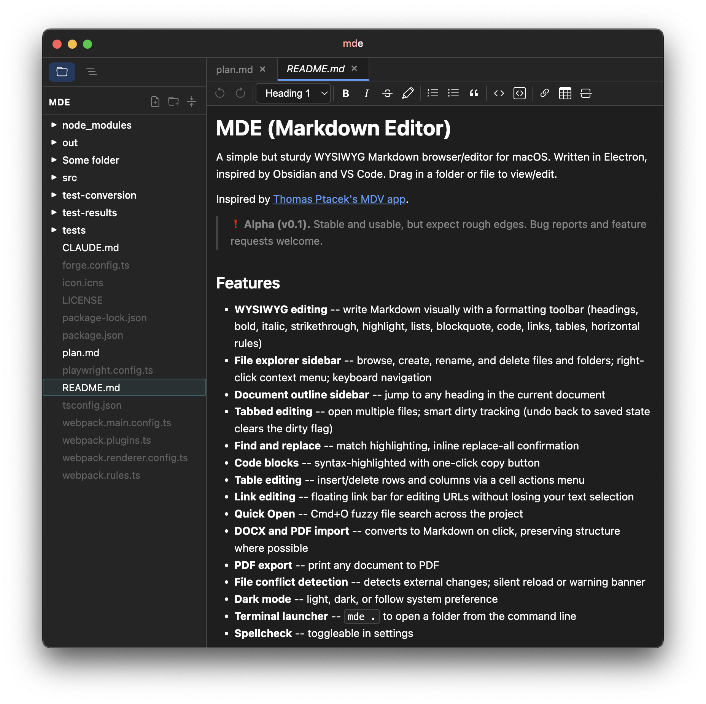

# MDE (Markdown Editor)

A simple but sturdy WYSIWYG Markdown browser/editor for macOS. Written in Electron, inspired by Obsidian and VS Code. Drag in a folder or file to view/edit.

Inspired by [Thomas Ptacek's MDV app](https://sockpuppet.org/blog/2026/05/12/emacsification/).

> ❗ **Alpha (v0.1).** Stable and usable, but expect rough edges. Bug reports and feature requests welcome.

## Features

- **WYSIWYG editing** -- write Markdown visually with a formatting toolbar
- **File Explorer & File Outline sidebar**
- **Tabbed editing** -- open multiple files, switch between them
- **Find and replace** -- match highlighting, inline replace-all confirmation
- **Code blocks** -- syntax-highlighted with one-click copy button
- **Table editing** -- insert/delete rows and columns via a cell actions menu
- **Link editing** -- floating link bar for editing URLs without losing your text selection
- **Quick Open** -- Cmd+O fuzzy file search across the project
- **DOCX and PDF import** -- converts to Markdown on click, preserving structure where possible
- **PDF export** -- print any document to PDF
- **File conflict detection** -- detects external changes; silent reload or warning banner
- **Dark mode** -- light, dark, or follow system preference
- **Terminal launcher** -- `mde .` to open a folder from the command line
- **Spellcheck** -- toggleable in settings



## How to install

Download the latest build for your platform from the releases page.

### macOS (Apple Silicon)

The app isn't code-signed, so macOS will block ("quarantine") it by default, giving you no option to proceed. To open the app:

1. Right-click (or Control-click) `MDE.app` and select **Open**
2. Click **Open** in the confirmation dialog

You only need to do this once. After that, macOS will remember your choice and let you open it normally.

### Windows

The app isn't code-signed, so Windows SmartScreen will show a warning the first time you launch it. Click **More info** → **Run anyway** to proceed.

## Note on HTML in Markdown

Handling `<` and `>` characters in Markdown is a surprisingly subtle problem. MDE does not render raw HTML -- tags like `<ol>` or `<div>` are displayed as literal text, not interpreted as HTML elements. As a side effect, if your `.md` files contain HTML entities like `&gt;` or `&lt;`, MDE may convert them to their literal characters (`>`, `<`) on save. This improves readability but means MDE-edited files may differ slightly from files authored in raw-text editors that preserve HTML entities verbatim.

## Getting started

```
npm install
npm start
```

Drag a folder onto the window to open it as a project, or use File &gt; Open.

### Terminal launcher

Open Settings (Cmd+,) and click "Install terminal launcher" to enable opening folders from the terminal:

```
mde .              # Open current directory
mde ~/my-notes     # Open a specific folder
```

## Tests

```
npm test
```

Runs headless Playwright E2E tests against a packaged build.

## Dev & test caveats

- In dev and test, dragging files/folders onto the dock app icon doesn't work. You need to manually test on the packaged app.
- In test, dragging files/folders into the app window doesn't work AFAICT. The tests skip this step and simulate triggering the drop, meaning potential bug space.

## Build & distribute

```
npm run make
```

Produces a distributable `.app` (macOS) in the `out/make/` directory.

## Tasks

### For me

- Keyboard Shortcuts help page (maybe open as a readonly tab/buffer?)
- Todo lists (checkable)
- TODO: Test the .docx & .pdf flow.
  - How much do they lose of the original structure & content?
- Support .csv files too. Plan this out.
- Support right-click to convert to .docx or .pdf, w standard nice-looking formatting & colors (customizable)
  - PDF export -- does this require chrome/puppeteer? can it just use the built-in engine?
- **Add Claude agent support.**
- Build to Windows (for Claire & Anny). Claude says this is straightforward w Electron Forge.

### For Claude

- Dial in the support for < and > in markdowns (don't escape them, maintain compatibility with raw markdown editors as much as possible)
- <code>...</code> is beautiful when INSIDE the editor window, it has a nice rounded border and a slightly lighter background. But outside of the editor window, in pop-up dialogs etc, it's just a font change with no border. Please make it have that border and different background color.
- Text styling: line-height should be reduced by 2px, top + bottom margin of each <li> should be increased by 3px. Currently there's no visible separation between li bullets apart from the stardard line-height within each bullet.
- When you delete a file, also close the tab for that file (and don't add it to the queue of closed tabs that can be re-opened via Cmd + Shift + T).
